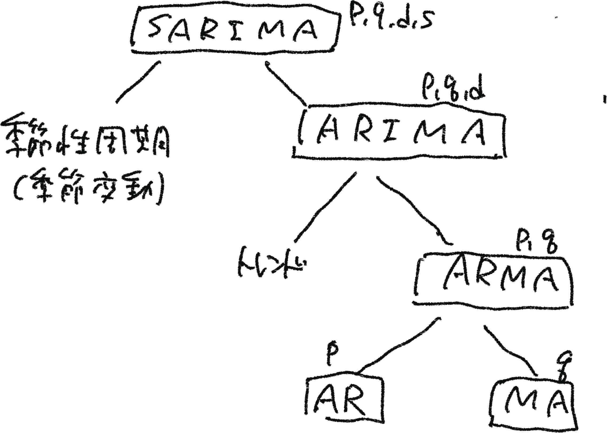

# 定常性と季節変動
<pre>
定常性
データの統計的性質（特に平均と分散）が長期的に安定していること
データの長期的な過去の挙動が、将来の挙動にどれくらい反映されているか

季節調整
季節変動の周期ｍがはっきりしており、各周期に渡って各季節成分の値が一定であれば、ｍ個の移動平均を取ることで、季節変動は除去できる。
</pre>
  
# SARIMA 季節変動自己回帰和分移動平均
<pre>
定常データ、非定常データ、季節性周期を含んだデータを扱える。
自己回帰モデルの手法はSARIMAの中に、すべて含まれる。
SARIMAが実装できれば、他の手法はSARIMAを分解すればよい。
</pre>

