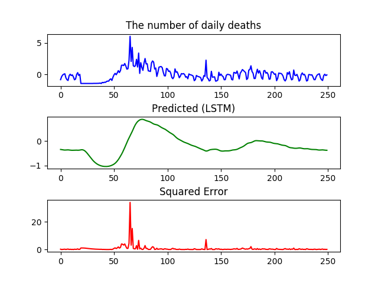

# COIVD-19

<pre>
# python date_plot_2.py 1.csv
</pre>

# LSTM

<pre>
# wget https://raw.githubusercontent.com/ytakefuji/fourier/main/d.csv
# python date_plot_2.py d.csv
# sed -e '1d' d.csv > tmp
# cat tmp tmp > argumented.csv
# lstm.py argumented.csv
</pre>

# US

